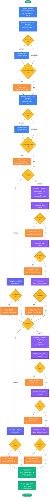

```mermaid
flowchart TD
    Start([START])
    
    Start --> BizInfo[Business Information<br/>Name, Description, Email, Staff Size<br/>TIN, Website, Address, Utility Bill]
    
    BizInfo --> Dir1Basic[Business Director 1 - Basic Information<br/>Name, DOB, Email, Phone<br/>Nationality, BVN, NIN, ID Card]
    
    Dir1Basic --> Dir1Emp{Employment<br/>Type?}
    Dir1Emp -->|Employed| Dir1EmpDetails[Employment Details<br/>Occupation, Address<br/>LGA, State, Country]
    Dir1EmpDetails --> Dir1PEP
    Dir1Emp -->|Unemployed| Dir1PEP{Is Director<br/>Politically Exposed<br/>Person?}
    
    Dir1PEP -->|Yes| Dir1PEPInfo[PEP Information<br/>Political Office<br/>Start Date, Current Position]
    Dir1PEPInfo --> Dir2Basic
    Dir1PEP -->|No| Dir2Basic[Business Director 2 - Basic Information<br/>Name, DOB, Email, Phone<br/>Nationality, BVN, NIN, ID Card]
    
    Dir2Basic --> Dir2Emp{Employment<br/>Type?}
    Dir2Emp -->|Employed| Dir2EmpDetails[Employment Details<br/>Occupation, Address<br/>LGA, State, Country]
    Dir2EmpDetails --> Dir2PEP
    Dir2Emp -->|Unemployed| Dir2PEP{Is Director<br/>Politically Exposed<br/>Person?}
    
    Dir2PEP -->|Yes| Dir2PEPInfo[PEP Information<br/>Political Office<br/>Start Date, Current Position]
    Dir2PEPInfo --> SH1Type
    Dir2PEP -->|No| SH1Type{Shareholder 1<br/>Type?}
    
    %% Shareholder 1 - Individual Path
    SH1Type -->|Individual| SH1Ind[Shareholder 1 Individual<br/>Name, Nationality, ID Card<br/>Percentage, NIN]
    SH1Ind --> SH1IndPEP{Is Shareholder<br/>PEP?}
    SH1IndPEP -->|Yes| SH1IndPEPInfo[PEP Information<br/>Political Office<br/>Start Date, Current Position]
    SH1IndPEPInfo --> SH2Type
    SH1IndPEP -->|No| SH2Type
    
    %% Shareholder 1 - Corporate Path
    SH1Type -->|Corporate| SH1Corp[Shareholder 1 Corporate - Company Info<br/>Company Name, CAC Number<br/>Percentage, Inc. Certificate, Status Report]
    
    SH1Corp --> SH1CorpDir1[Corporate SH1 - Director 1<br/>Name, Email, Phone<br/>BVN, NIN]
    SH1CorpDir1 --> SH1CorpDir1PEP{Is Director 1<br/>PEP?}
    SH1CorpDir1PEP -->|Yes| SH1CorpDir1PEPInfo[Director 1 PEP Info<br/>Political Office<br/>Start Date, Current Position]
    SH1CorpDir1PEPInfo --> SH1CorpDir2
    SH1CorpDir1PEP -->|No| SH1CorpDir2[Corporate SH1 - Director 2<br/>Name, Email, Phone<br/>BVN, NIN]
    
    SH1CorpDir2 --> SH1CorpDir2PEP{Is Director 2<br/>PEP?}
    SH1CorpDir2PEP -->|Yes| SH1CorpDir2PEPInfo[Director 2 PEP Info<br/>Political Office<br/>Start Date, Current Position]
    SH1CorpDir2PEPInfo --> SH1CorpMajor
    SH1CorpDir2PEP -->|No| SH1CorpMajor[Corporate SH1 - Major Shareholder<br/>Name, Percentage Holding]
    
    SH1CorpMajor --> SH1CorpMajorPEP{Is Major<br/>Shareholder<br/>PEP?}
    SH1CorpMajorPEP -->|Yes| SH1CorpMajorPEPInfo[Major SH PEP Info<br/>Political Office<br/>Start Date, Current Position]
    SH1CorpMajorPEPInfo --> SH2Type
    SH1CorpMajorPEP -->|No| SH2Type
    
    %% Shareholder 2 Type Selection
    SH2Type{Shareholder 2<br/>Type?}
    
    %% Shareholder 2 - Individual Path
    SH2Type -->|Individual| SH2Ind[Shareholder 2 Individual<br/>Name, Nationality, ID Card<br/>Percentage, NIN]
    SH2Ind --> SH2IndPEP{Is Shareholder<br/>PEP?}
    SH2IndPEP -->|Yes| SH2IndPEPInfo[PEP Information<br/>Political Office<br/>Start Date, Current Position]
    SH2IndPEPInfo --> CACDocs
    SH2IndPEP -->|No| CACDocs
    
    %% Shareholder 2 - Corporate Path
    SH2Type -->|Corporate| SH2Corp[Shareholder 2 Corporate - Company Info<br/>Company Name, CAC Number<br/>Percentage, Inc. Certificate, Status Report]
    
    SH2Corp --> SH2CorpDir1[Corporate SH2 - Director 1<br/>Name, Email, Phone<br/>BVN, NIN]
    SH2CorpDir1 --> SH2CorpDir1PEP{Is Director 1<br/>PEP?}
    SH2CorpDir1PEP -->|Yes| SH2CorpDir1PEPInfo[Director 1 PEP Info<br/>Political Office<br/>Start Date, Current Position]
    SH2CorpDir1PEPInfo --> SH2CorpDir2
    SH2CorpDir1PEP -->|No| SH2CorpDir2[Corporate SH2 - Director 2<br/>Name, Email, Phone<br/>BVN, NIN]
    
    SH2CorpDir2 --> SH2CorpDir2PEP{Is Director 2<br/>PEP?}
    SH2CorpDir2PEP -->|Yes| SH2CorpDir2PEPInfo[Director 2 PEP Info<br/>Political Office<br/>Start Date, Current Position]
    SH2CorpDir2PEPInfo --> SH2CorpMajor
    SH2CorpDir2PEP -->|No| SH2CorpMajor[Corporate SH2 - Major Shareholder<br/>Name, Percentage Holding]
    
    SH2CorpMajor --> SH2CorpMajorPEP{Is Major<br/>Shareholder<br/>PEP?}
    SH2CorpMajorPEP -->|Yes| SH2CorpMajorPEPInfo[Major SH PEP Info<br/>Political Office<br/>Start Date, Current Position]
    SH2CorpMajorPEPInfo --> CACDocs
    SH2CorpMajorPEP -->|No| CACDocs
    
    %% Final Documents
    CACDocs[CAC Registration Documents<br/>Board Resolution, CAC Doc<br/>Articles, RC Number, Status Report]
    CACDocs --> Licenses[Licenses and Certificates<br/>AML/CFT Policy<br/>CDD/KYC Policy, Operating License]
    
    Licenses --> End([SUBMIT FORM])
    
    %% Styling
    classDef processStyle fill:#3b82f6,stroke:#1e40af,stroke-width:2px,color:#fff
    classDef decisionStyle fill:#fbbf24,stroke:#d97706,stroke-width:2px,color:#78350f
    classDef pepStyle fill:#fb923c,stroke:#ea580c,stroke-width:2px,color:#fff
    classDef corpStyle fill:#8b5cf6,stroke:#6d28d9,stroke-width:2px,color:#fff
    classDef indStyle fill:#6366f1,stroke:#4338ca,stroke-width:2px,color:#fff
    classDef docStyle fill:#10b981,stroke:#047857,stroke-width:2px,color:#fff
    classDef startEndStyle fill:#10b981,stroke:#047857,stroke-width:3px,color:#fff
    
    class BizInfo,Dir1Basic,Dir2Basic processStyle
    class Dir1Emp,Dir1PEP,Dir2Emp,Dir2PEP,SH1Type,SH2Type,SH1IndPEP,SH2IndPEP,SH1CorpDir1PEP,SH1CorpDir2PEP,SH1CorpMajorPEP,SH2CorpDir1PEP,SH2CorpDir2PEP,SH2CorpMajorPEP decisionStyle
    class Dir1PEPInfo,Dir2PEPInfo,SH1IndPEPInfo,SH2IndPEPInfo,SH1CorpDir1PEPInfo,SH1CorpDir2PEPInfo,SH1CorpMajorPEPInfo,SH2CorpDir1PEPInfo,SH2CorpDir2PEPInfo,SH2CorpMajorPEPInfo pepStyle
    class SH1Corp,SH1CorpDir1,SH1CorpDir2,SH1CorpMajor,SH2Corp,SH2CorpDir1,SH2CorpDir2,SH2CorpMajor corpStyle
    class SH1Ind,SH2Ind indStyle
    class Dir1EmpDetails,Dir2EmpDetails processStyle
    class CACDocs,Licenses docStyle
    class Start,End startEndStyle
```
