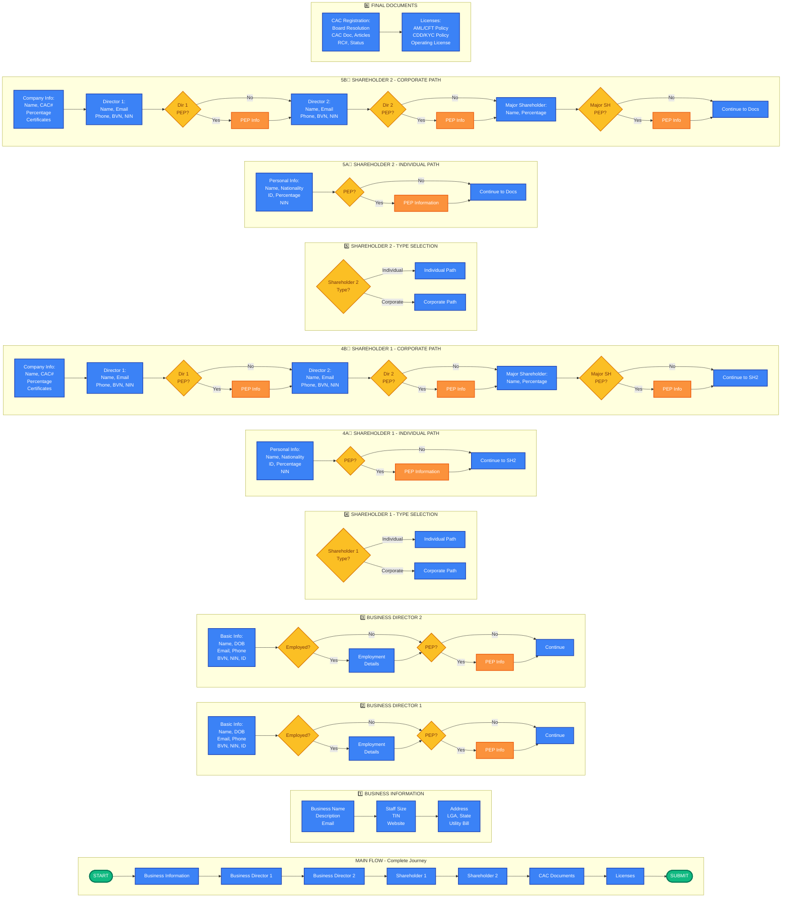

```mermaid
flowchart LR
    subgraph Main["MAIN FLOW - Complete Journey"]
        direction LR
        Start([START]) --> BizInfo[Business Information]
        BizInfo --> Dir1[Business Director 1]
        Dir1 --> Dir2[Business Director 2]
        Dir2 --> SH1[Shareholder 1]
        SH1 --> SH2[Shareholder 2]
        SH2 --> Docs[CAC Documents]
        Docs --> Licenses[Licenses]
        Licenses --> End([SUBMIT])
    end
    
    subgraph BizDetails["1️⃣ BUSINESS INFORMATION"]
        direction LR
        B1[Business Name<br/>Description<br/>Email] --> B2[Staff Size<br/>TIN<br/>Website] --> B3[Address<br/>LGA, State<br/>Utility Bill]
    end
    
    subgraph Dir1Flow["2️⃣ BUSINESS DIRECTOR 1"]
        direction LR
        D1A[Basic Info:<br/>Name, DOB<br/>Email, Phone<br/>BVN, NIN, ID] --> D1B{Employed?}
        D1B -->|Yes| D1C[Employment<br/>Details]
        D1B -->|No| D1D{PEP?}
        D1C --> D1D
        D1D -->|Yes| D1E[PEP Info]
        D1D -->|No| D1F[Continue]
        D1E --> D1F
    end
    
    subgraph Dir2Flow["3️⃣ BUSINESS DIRECTOR 2"]
        direction LR
        D2A[Basic Info:<br/>Name, DOB<br/>Email, Phone<br/>BVN, NIN, ID] --> D2B{Employed?}
        D2B -->|Yes| D2C[Employment<br/>Details]
        D2B -->|No| D2D{PEP?}
        D2C --> D2D
        D2D -->|Yes| D2E[PEP Info]
        D2D -->|No| D2F[Continue]
        D2E --> D2F
    end
    
    subgraph SH1Flow["4️⃣ SHAREHOLDER 1 - TYPE SELECTION"]
        direction LR
        S1Start{Shareholder 1<br/>Type?} -->|Individual| S1Ind[Individual Path]
        S1Start -->|Corporate| S1Corp[Corporate Path]
    end
    
    subgraph SH1IndFlow["4A️⃣ SHAREHOLDER 1 - INDIVIDUAL PATH"]
        direction LR
        S1I1[Personal Info:<br/>Name, Nationality<br/>ID, Percentage<br/>NIN] --> S1I2{PEP?}
        S1I2 -->|Yes| S1I3[PEP Information]
        S1I2 -->|No| S1I4[Continue to SH2]
        S1I3 --> S1I4
    end
    
    subgraph SH1CorpFlow["4B️⃣ SHAREHOLDER 1 - CORPORATE PATH"]
        direction LR
        S1C1[Company Info:<br/>Name, CAC#<br/>Percentage<br/>Certificates] --> S1C2[Director 1:<br/>Name, Email<br/>Phone, BVN, NIN]
        S1C2 --> S1C3{Dir 1<br/>PEP?}
        S1C3 -->|Yes| S1C4[PEP Info]
        S1C3 -->|No| S1C5[Director 2:<br/>Name, Email<br/>Phone, BVN, NIN]
        S1C4 --> S1C5
        S1C5 --> S1C6{Dir 2<br/>PEP?}
        S1C6 -->|Yes| S1C7[PEP Info]
        S1C6 -->|No| S1C8[Major Shareholder:<br/>Name, Percentage]
        S1C7 --> S1C8
        S1C8 --> S1C9{Major SH<br/>PEP?}
        S1C9 -->|Yes| S1C10[PEP Info]
        S1C9 -->|No| S1C11[Continue to SH2]
        S1C10 --> S1C11
    end
    
    subgraph SH2Flow["5️⃣ SHAREHOLDER 2 - TYPE SELECTION"]
        direction LR
        S2Start{Shareholder 2<br/>Type?} -->|Individual| S2Ind[Individual Path]
        S2Start -->|Corporate| S2Corp[Corporate Path]
    end
    
    subgraph SH2IndFlow["5A️⃣ SHAREHOLDER 2 - INDIVIDUAL PATH"]
        direction LR
        S2I1[Personal Info:<br/>Name, Nationality<br/>ID, Percentage<br/>NIN] --> S2I2{PEP?}
        S2I2 -->|Yes| S2I3[PEP Information]
        S2I2 -->|No| S2I4[Continue to Docs]
        S2I3 --> S2I4
    end
    
    subgraph SH2CorpFlow["5B️⃣ SHAREHOLDER 2 - CORPORATE PATH"]
        direction LR
        S2C1[Company Info:<br/>Name, CAC#<br/>Percentage<br/>Certificates] --> S2C2[Director 1:<br/>Name, Email<br/>Phone, BVN, NIN]
        S2C2 --> S2C3{Dir 1<br/>PEP?}
        S2C3 -->|Yes| S2C4[PEP Info]
        S2C3 -->|No| S2C5[Director 2:<br/>Name, Email<br/>Phone, BVN, NIN]
        S2C4 --> S2C5
        S2C5 --> S2C6{Dir 2<br/>PEP?}
        S2C6 -->|Yes| S2C7[PEP Info]
        S2C6 -->|No| S2C8[Major Shareholder:<br/>Name, Percentage]
        S2C7 --> S2C8
        S2C8 --> S2C9{Major SH<br/>PEP?}
        S2C9 -->|Yes| S2C10[PEP Info]
        S2C9 -->|No| S2C11[Continue to Docs]
        S2C10 --> S2C11
    end
    
    subgraph DocsFlow["6️⃣ FINAL DOCUMENTS"]
        direction LR
        DC1[CAC Registration:<br/>Board Resolution<br/>CAC Doc, Articles<br/>RC#, Status] --> DC2[Licenses:<br/>AML/CFT Policy<br/>CDD/KYC Policy<br/>Operating License]
    end
    
    classDef processStyle fill:#3b82f6,stroke:#1e40af,stroke-width:2px,color:#fff
    classDef decisionStyle fill:#fbbf24,stroke:#d97706,stroke-width:2px,color:#78350f
    classDef pepStyle fill:#fb923c,stroke:#ea580c,stroke-width:2px,color:#fff
    classDef startEndStyle fill:#10b981,stroke:#047857,stroke-width:3px,color:#fff
    
    class Start,End startEndStyle
    class D1B,D1D,D2B,D2D,S1Start,S2Start,S1I2,S2I2,S1C3,S1C6,S1C9,S2C3,S2C6,S2C9 decisionStyle
    class D1E,D2E,S1I3,S2I3,S1C4,S1C7,S1C10,S2C4,S2C7,S2C10 pepStyle
    class BizInfo,Dir1,Dir2,SH1,SH2,Docs,Licenses,B1,B2,B3,D1A,D1C,D1F,D2A,D2C,D2F,S1Ind,S1Corp,S2Ind,S2Corp,S1I1,S1I4,S2I1,S2I4,S1C1,S1C2,S1C5,S1C8,S1C11,S2C1,S2C2,S2C5,S2C8,S2C11,DC1,DC2 processStyle
```
